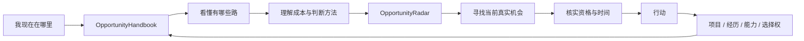

# 机会与成长指南

<div align="center">

**不是替你决定人生，而是让你第一次看清：自己到底在选择什么。**

[在线阅读](https://sver0411.github.io/OpportunityHandbook/) · [按条件筛选](https://sver0411.github.io/OpportunityHandbook/#/browse) · [正文目录](book/README.md) · [专题索引](docs/README.md) · [参与贡献](CONTRIBUTING.md)

</div>

---

> **很多重要选择，真正昂贵的不是选错，而是太晚才知道原来还有别的选项。**

很多人第一次知道「保研」和「考研」真正的区别，是大三。

第一次知道科研并不等于「发论文」，是准备申请研究生的时候。

第一次认真研究实习、校招、内推、作品集、开源、奖学金、暑研、RA、交换、行业组织，是发现别人已经做了两三年的时候。

工作以后也一样：什么时候该跳槽？技术还是管理？要不要为了转行降薪？工作几年以后再读硕士还有没有意义？副业什么时候才值得变主业？

这些问题很少有人系统教过。学校告诉你怎么完成眼前这一阶段，招聘网站告诉你哪个公司正在招人，社交媒体给你无数互相矛盾的建议——但很少有一个地方告诉你：**你现在其实站在哪张地图上。**

---

## 你缺的可能不是一个答案，而是一张地图

假设你现在大二。你可能知道上课、考试、四六级、考研、找工作，但未必知道这些东西彼此是什么关系：

```text
科研        暑研        RA          实习        竞赛
开源        作品集      交换        奖学金      行业组织
Student Chapter         导师推荐信
保研        考研        海外硕士    Research Master      PhD
校招        提前批      内推        Graduate Program
```

更重要的是，你未必知道：

```text
哪些事情现在不做，以后还能补？
哪些事情错过窗口以后代价会突然变高？
哪些经历能同时给未来几条路线增加筹码？
哪些看起来很厉害，其实对你的目标几乎没有帮助？
```

这份手册想解决的就是这件事。它不给你一份「标准人生路线」，而是把原本散落在不同学校、行业、国家、招聘体系和过来人经验里的路径，放到同一张地图上，让你自己判断下一步。

## 这不是「大学生攻略」

它从高中毕业后的选择开始，但不会在毕业时结束。你会在不同阶段反复遇到类似的问题：

```text
我要继续读书，还是先工作？
学校和专业哪个更重要？
实习、科研、项目、比赛到底应该选哪个？
我要不要出国？
第一份工作最重要的是工资、平台还是成长？
什么时候应该第一次跳槽？
技术路线还是管理路线？
转行需要把过去全部清零吗？
工作以后还值得重新读书吗？
自由职业、副业、创业什么时候才值得尝试？
```

它覆盖的不是某一个身份，而是一个人从「我不知道自己能做什么」，逐渐走到「我知道自己为什么做这个选择」的过程。

## Handbook × Radar

有两类问题本质不同。

**第一类**——我有哪些路？这条路到底是什么？什么时候值得走？成本是什么？走错了还能不能回来？——这是 **OpportunityHandbook**（本书）负责的。

**第二类**——那现在到底有什么机会？哪些还开放？我符合条件吗？截止日期是什么？该先申请哪个？——这是 [**OpportunityRadar**](https://github.com/Sver0411/OpportunityRadar) 负责的。它是一个 Agent Skill，按你的背景和目标搜索实习、工作、科研、比赛、奖学金、交换、开源项目、行业活动、社群、进修与创业机会，并尽量回到官方网站核实是否仍开放、截止日期、申请资格、地点、费用与官方入口。



简单说：**Handbook 帮你决定应该寻找什么，Radar 帮你找到它。** 一个建立认知，一个连接现实。

两个项目保持独立，这是有意的。Handbook 稳定、公开、可引用、低时效依赖、适合长期阅读；Radar 动态、面向当前、需要搜索与核实最新状态。一个知识库不应该每天因为招聘截止日期而改动，一个机会搜索器也不应该承担整套路径教育——稳定知识与动态机会，本来就是两层系统。

## 一个真实的使用方式

比如你突然开始想：「我要不要尝试科研？」

不要先搜「本科生科研怎么找」，然后打开二十篇互相复制的文章。先在本书里弄清：科研每天到底在做什么、什么样的人适合先试一次、第一次科研需要做到什么程度、科研与项目和实习有什么区别、怎么判断一个实验室、怎么联系导师、这段经历最后能留下什么。

然后你可能发现：我不是想「发一篇论文」，我只是想验证自己是否喜欢研究，并留下一个真实的研究经历。这时候再把这个目标交给 Radar：

```text
我是本科生，对机器人和嵌入式方向感兴趣。
我想低成本尝试一次科研，每周大约能投入 8 小时。
帮我找目前仍然开放的科研、实验室项目、暑研或相关机会，
优先能留下真实成果的。
```

Radar 才开始搜索现实世界。这比一开始就问「有什么科研推荐」有效得多——因为你已经知道自己在找什么。

## 它真正想解决的是「信息差之前的那一层」

人们经常把问题归结为信息差，但比信息差更早发生的是：**你甚至不知道自己应该搜索什么。**

如果你从来没听过这些词，搜索引擎再强也没有用：

```text
暑研        Research Internship    RA            Student Chapter
Travel Grant                Graduate Program    Off-cycle Internship
Maintainer  Fellowship             Bridge Opportunity
```

你不会搜索一个自己根本不知道存在的东西。所以这本书的价值不是「收集更多链接」，而是不断扩展你的**机会词汇表**。当一个人知道世界上存在更多路径，他真正得到的不只是信息，而是选择权。

## 它最在意的不是「成功」，而是选择权

有些事情的价值并不在于立刻换来什么：英语、写作、真实项目、研究经历、作品集、公开贡献、行业关系、可验证成果——它们的共同特点是**今天做了，不只服务于今天的一条路线**。

一次真正完成的项目，可以用于找实习、找工作、申请研究生、联系导师、转专业、转行、做作品集。一次可靠的科研经历，也可能同时帮你判断自己喜不喜欢研究、申请研究型硕士或博士、拿到推荐信、进入相关行业。

所以这本书特别关注这类东西：一个好的选择，不一定是马上收益最高的那个，更可能是**让你一年以后拥有更多选择的那个**。

## 所以这里不会告诉你「标准答案」

你不会在这里看到「一定要读研」「一定要进大厂」「年轻人一定要创业」「这个行业未来一定……」。因为脱离条件的建议几乎没有意义。这里更常出现的是：

```text
先看目标岗位有没有学历硬门槛。
先算最坏情况下你能不能承担这笔成本。
先看看这个选择能留下什么可验证成果。
先确认这个资格是不是法律规定的准入条件。
先问自己：如果判断错了，我还能不能回来？
```

本书不替你做决定。它只希望：当你做决定的时候，至少知道自己放弃了什么，又换回了什么。

## 内容是怎么组织的

主线不按「知识分类」排列，而按一个人更可能遇到问题的顺序：

```text
00  使用指南与选择方法
01  升学、就业与教育选择
02  学业、技能、语言与证书
03  项目、竞赛、科研与实习
04  考研、保研、留学与科研
05  校招、求职与第一份工作
06  职场入门与成长
07  晋升、跳槽、转行与再深造
08  自由职业、副业、创业与第二职业
09  专题索引
10  时间线与实用工具
11  常见陷阱与避坑
```

你不需要从头读到尾。它更像一本长期放在手边的参考手册，遇到问题时回来查。

## 你可以直接从这些问题开始

### 我还在学校

- [我到底要不要读研？](book/04-当你开始面对第一次重要分流.md#grad-school-worth-it)
- [保研和考研应该怎么选？](book/04-当你开始面对第一次重要分流.md#baoyan-vs-kaoyan)
- [学校和专业哪个更重要？](book/01-先决定下一步往哪里走.md#choose-school-vs-major)
- [什么比赛值得参加？](book/03-开始积累真正能留下来的经历.md#competition-what-worth-joining)
- [这个比赛是不是交了钱就能拿奖？](book/03-开始积累真正能留下来的经历.md#competition-what-worth-joining)
- [本科生怎么开始科研？](book/03-开始积累真正能留下来的经历.md#research-undergrad-start)
- [我的 GitHub 项目算项目经历吗？](book/03-开始积累真正能留下来的经历.md#project-what-is-real)
- [什么证书值得考？](book/02-在学校里先把基础打好.md#certificate-what-is-worth-it)

### 我快毕业了

- [第一份工作应该怎么看？](book/05-从学校走向第一份工作.md#first-job-what-to-trade-for)
- [两个 Offer 应该怎么比较？](book/05-从学校走向第一份工作.md#offer-comparison)
- [大公司还是小公司？](book/05-从学校走向第一份工作.md#first-job-big-vs-small)
- [工资还是成长？](book/05-从学校走向第一份工作.md#first-job-pay-vs-growth)
- [一直找不到工作怎么办？](book/05-从学校走向第一份工作.md#job-hunting-long-search)

### 我已经工作了

- [工作几年以后应该怎么升职？](book/06-进入职场以后继续积累.md#work-record-achievements)
- [什么时候适合第一次跳槽？](book/06-进入职场以后继续积累.md#career-job-hopping)
- [技术还是管理？](book/07-当职业开始出现分岔.md#mgmt-ic-or-manager)
- [转行前应该先判断什么？](book/07-当职业开始出现分岔.md#switch-before-decide)
- [转行要不要从零开始？](book/07-当职业开始出现分岔.md#career-change-keep-capital)
- [工作后还值得读硕士吗？](book/07-当职业开始出现分岔.md#edu-master-after-work)

### 我根本不知道自己想做什么

- [不知道自己想做什么怎么办？](book/02-在学校里先把基础打好.md#explore-low-cost-experiments)
- [怎么比较两个完全不同的机会？](book/00-从这里开始.md#judge-compare-two-opportunities)
- [什么东西值得长期积累](book/00-从这里开始.md#judge-long-term-accumulation)
- [什么叫未来选择权](book/00-从这里开始.md#judge-optionality)

## 除了正文，还有几种更实用的入口

**时间线**——当你知道目标、但不知道什么时候做：本科四年、保研、考研、留学申请、校招、科研入门、博士申请、转行，见 [`docs/timelines/`](docs/timelines/)。

**工具**——当你已经开始做决定：Offer 对比表、导师筛选表、留学选校表、求职追踪表、职业资本盘点表、转行 Bridge Plan，见 [`docs/tools/`](docs/tools/)。

**专题**——当你需要查一个领域：国家与地区、行业与职业、科研、竞赛、开源、证书、语言、资助、创业，见 [`docs/`](docs/)。

在线页面还支持叠加筛选：人生阶段、方向、能换回什么、投入大小、证据类型。例如「专科 + 想拿学历 + 低投入」，或「工作 3–5 年 + 想转行 + 能接受降薪」。

## 为什么不是直接让 AI 回答？

当然可以。但路径类问题有一个麻烦：AI 很容易给出一个「听起来很完整」的答案。真正困难的是——哪些是事实？哪些是经验？哪些规则已经变了？这是全国规则还是某个学校的规则？这个建议对什么情况成立？数据从哪里来的？

所以本书给每类信息保留证据边界，内容会区分：

```text
Official        官方规则与政策文件
Research-backed 有研究支持
Industry data   行业数据（口径与时效需核对）
Experience-based 实践经验（当成参考，不是结论）
Uncertain       暂无可靠来源，或存在争议
```

容易变化的信息带有 `last_verified` 核实日期，长期没有重新核实的页面会提示可能需要重新核实。来源默认折叠、不影响阅读，真正准备行动时再展开核对。

## 一个基本原则：不知道，就不要装作知道

这里不会为了让文章显得完整而编造成功率、录取率、行业平均薪资，也不会断言某个选择「更容易成功」、某个国家「更好留下」。没有可靠来源，就不把它写成事实；经验性判断尽量保留边界与反例。

因为一个知识库真正值得长期使用，靠的不是每个问题都有答案，而是**你知道哪些答案可以相信到什么程度**。

## 它不做什么

- **不替你决定。**没有「你就该……」这种句子，只有条件和代价。
- **不推荐付费机会。**不收钱、不返佣，也没有需要扫码的入口；营销软文与培训机构文章不作为依据。
- **不追热点。**追着风口写的内容两年后就过期了；这里写的是变化更慢的判断方法。
- **不替代专业意见。**法律、医疗、投资与具体岗位的最终决定，请找对应领域的专业人士与官方公告。

## 如果你只记住一件事

不是每一个机会都值得抓住，不是每一种能力都值得学，也不是每一条看起来更快的路都真的更短。真正值得积累的东西往往有一个共同点：**即使你几年以后改变方向，它仍然不会完全失效。**

知识、能力、作品、成果、可信关系，以及对自己真正喜欢什么的认识，都会让下一次选择变得容易一点。这也是本书最终想留下的东西：不是一条正确路线，而是在越来越复杂的世界里，仍然有能力看懂选择，并且保留重新选择的权利。

## 参与维护

如果你发现某条规则已经变化、某个官方链接已经失效、某段经验被写得过于绝对、某个重要路径还没有覆盖，或者某篇内容没有真正解决标题里的问题，欢迎提交 Issue 或 PR。

开始之前请读 [CONTRIBUTING.md](CONTRIBUTING.md)——本书对事实来源、最后核实日期、经验性判断与内容边界都有明确要求，新增条目需要写明依据与核实日期。尚未撰写的部分列在仓库内的 [内容路线图](docs/ROADMAP.md)，仅面向贡献者，不会出现在导航与搜索里。

<details>
<summary><strong>开发与本地预览</strong></summary>

<br>

本地构建：

```bash
python3 tools/build.py
python3 -m http.server 8000 --directory site
```

完整发布校验（CI 与 Pages 同源）：

```bash
python3 tools/validate_release.py
```

其他维护工具：

| 命令 | 用途 |
| --- | --- |
| `python3 tools/build.py --strict` | 元数据、内部链接与构建校验（严格模式） |
| `python3 tools/check_ia.py` | 目录（Canonical IA）与正文的一致性 |
| `python3 tools/check_markdown_quality.py` | Markdown 格式检查 |
| `python3 tools/check_content_quality.py --hard` | 正文质量硬门（旧模板 / 缺 summary / 结构性质量） |
| `python3 tools/check_content_quality.py --depth` | 正文深度审计，输出 `reports/content-depth.md` |
| `python3 tools/metadata_audit.py` | 人生阶段（stages）与元数据审计 |
| `python3 tools/check_html_ids.py` | HTML id 唯一性与条目锚点前缀 |
| `python3 tools/check_docs_consistency.py` | docs 与正文的一致性 |
| `python3 tools/audit_article_structure.py` | 文章结构审计（发现批量模板感） |
| `python3 tools/audit_timeline.py` | 时间线专项审计（经验节奏 vs 统一规则） |
| `python3 tools/audit_claims.py --only-expensive` | 声明审计（经验性判断里的统计式断言） |
| `python3 tools/run_tests.py` | 内容规则测试 |
| `python3 tools/smoke_test.py` | 浏览器冒烟测试 |

审计报告统一放在 [`reports/`](reports/)；一次性迁移脚本放在 [`tools/migrations/`](tools/migrations/)，说明见 [tools/migrations/README.md](tools/migrations/README.md)。

</details>

---

## License

正文（`book/`、`docs/`、`meta/`、README）采用 **CC BY 4.0**：署名后可自由复制、修改、翻译与商用，详见 [LICENSE-CONTENT](LICENSE-CONTENT)。站点与工具代码采用 **MIT**，详见 [LICENSE](LICENSE)。

知识只有在被用起来之后才算数。如果你把它搬进课堂、社团、公司内部培训或者别的语言里，不用先问我们。

正文是信息整理与判断框架，不构成法律、医疗、投资或职业决策建议。文中引用的第三方内容版权归原权利人。

<div align="center">

### OpportunityHandbook × OpportunityRadar

**先看清路，再去找机会。**

[开始阅读](https://sver0411.github.io/OpportunityHandbook/) · [用 Radar 寻找真实机会](https://github.com/Sver0411/OpportunityRadar)

</div>
